```{r}
#| echo: false
library(webexercises)
```

# Week 10 : Mediation/Moderation Analysis {.unnumbered}

## Learning Objectives

When you have completed this workshop, you should be able to:

1. Carry out a simple mediation analysis with one predictor and one mediator using Jamovi
2. Interpret and report the findings of a simple mediation analysis.
3. Carry out a simple moderation analysis with one predictor and one moderator using Jamovi
4. Interpret and report the findings of a simple moderation analysis

::: {.callout-note}
## Before you start: Installing the medmod module in Jamovi 
The 'medmod' module (pronounced 'meed-mod') allows us to perform **med**iation and **mod**eration analysis using Jamovi in a few simple steps. Here's how to get the extension installed: 

**Step 1: Open the Jamovi library**
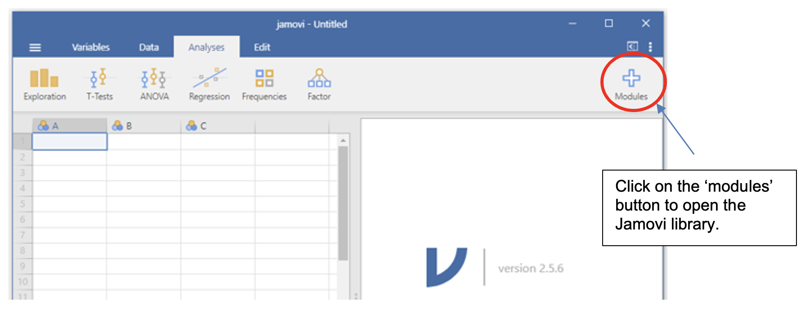

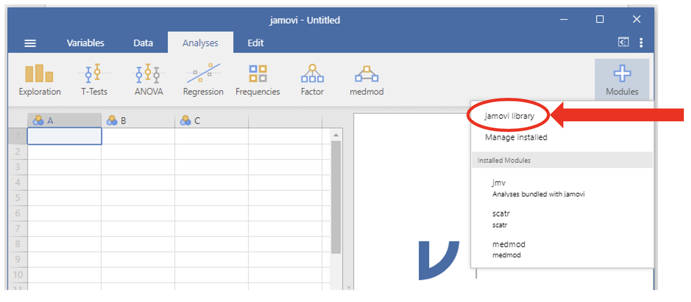

**Step 2: Find medmod and install it**

Scroll through the 'available' tab modules until you find **medmod**. Click install. 

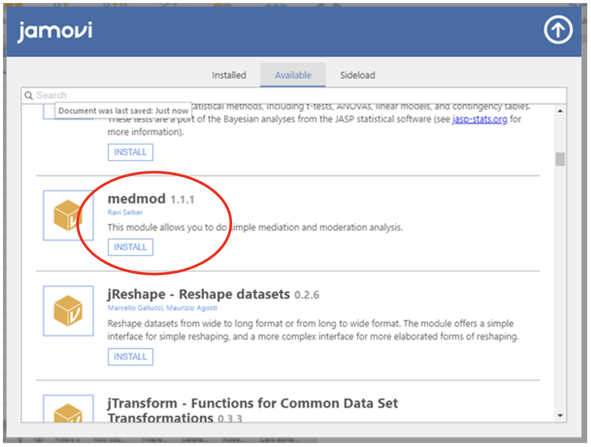

Once you have installed medmod, you should have another menu option in the Jamovi working window.

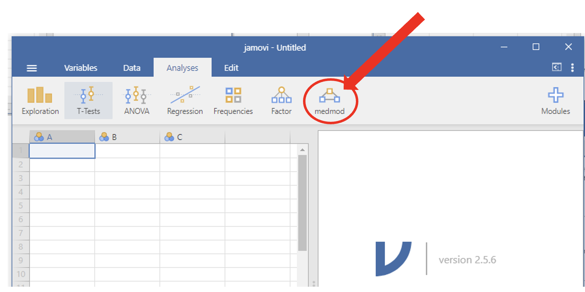

:::


## Using medmod in Jamovi to carry out mediation analysis

Open **PredictingRMDGrade.csv**. This made-up dataset (also used in the mediation/moderation lecture) looks at several factors that might play a role in predicting RMD grade. The variables in the dataset are: 

* Interest (Interest in research methods)

* Time_on_insta (Hours per week spent on Instagram)

* Intelligence (IQ score (norm=100))

* Attendance (Number of workshops and lectures attended)

* RMD Grade

For this example, we want to examine if attendance predicts RMD grade, and if this attendance is in fact mediated by interest in research methods. The idea is that people who are interested are more likely to attend and that some of the variance in RMD grade can be explained through the relationship between interest and RMD grade.

In the model we want to test, RMD grade is the DV (Y), Attendance is the IV (X) and Interest is the mediator (M).

1.	Load the **PredictingRMDGrade.csv** data

2.	In the medmod menu, select mediation.

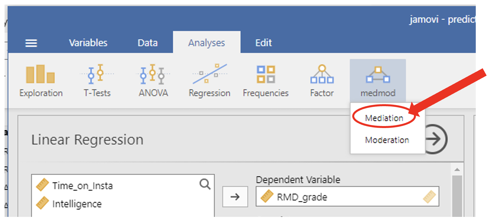

3. Set up the mediation analysis: 

    a. Put the DV (RMD_grade) into the Dependent Variable box. 
    b. Put the IV (Attendance) in the Predictor box. 
    c. Put the Mediator (interest) in the mediator box. 
    d. In the options in the lowest part of the mediation panel, select the following options: 
        i. In 'Estimation Method for SE's', select 'Standard' 
        ii. In 'Estimates', select 'Labels', 'Test statistics', 'Confidence interval' with the interval being 95%, and 'Percent mediation' 
        iii. In 'Additional Output', select 'Path estimates' 

        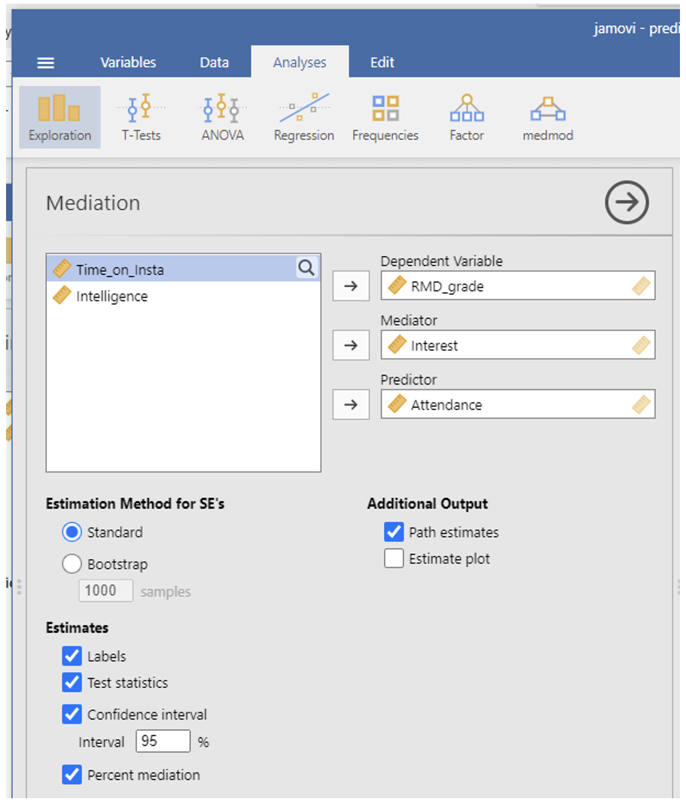


### Output: Mediation (medmod)

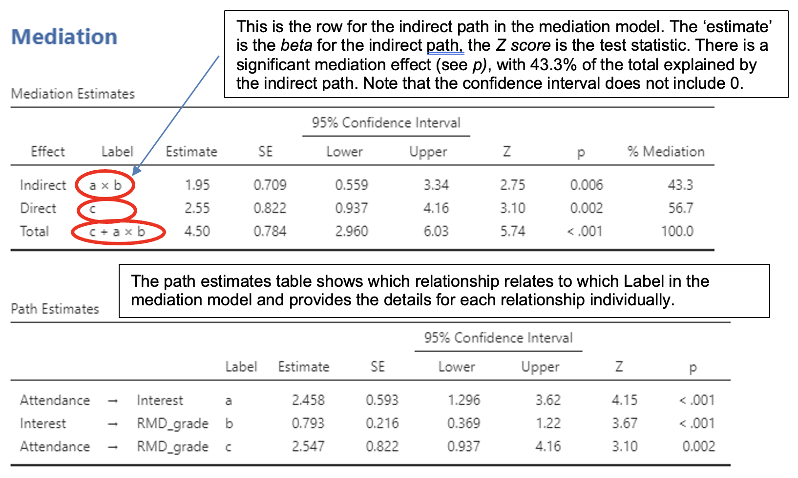

### Reporting a mediation analysis 

When reporting a mediation analysis, you should include the following information:

* An outline of what analysis was performed and how under the Data Analysis subheading of the Method
* A specification of what the analysis was used to test (information about the variables involved)
* A figure illustrating the relationship between the variables
* Include the beta (estimate) for the effect, the 95% confidence interval, the Z-score, and the p-value.
* Acknowledge how the analysis relates to your hypothesis.

*Example report of the analysis about predicting RMD Grades from attendance and whether this relationship is mediated by interest:*

*Data analysis*
A mediation analysis, using jamovi’s medmod module (The jamovi project, 2025), was carried out to investigate the relationship between attendance (IV), interest in research methods (mediator), and RMD grade (DV). 

*Results*
Data from 25 participants was analysed to test the hypothesis that the relationship between attendance and RMD grade is mediated by interest. Figure 1 illustrates the relationship of the effect of attendance on RMD grade as mediated through interest in research methods.

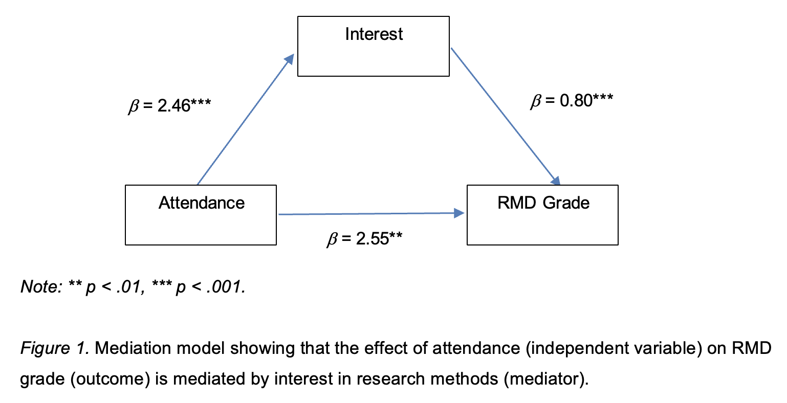

As predicted, the mediation analysis showed a significant indirect effect of attendance on RMD grade through interest (β = 1.95, 95% CI [0.559, 3.34], Z = 2.75 , *p* = .006).

Note: For discussing mediation effects, think about possible mechanism that can explain the causal links between the variables. For the attendance and interest example, comment on what role interest might play both through its relationship with attendance (might more interested people attend more?) and its relationship with grade (might being interested help with achieving higher grade?)

## Jamovi Tasks - Mediation

*Does sleep quality mediate the effect of stress upon academic performance?*

Using **stress_sleep_AcadPerf_mediation.csv**, test the hypothesis that sleep quality mediates the effect of stress upon academic performance.

Carry out a mediation analysis.

:::: callout-tip
## Test your understanding

::: panel-tabset
## Mediation analysis

1. What was the coefficient (estimate) for the direct effect? `r fitb(0.055)`%

2. What was the coefficient (estimate) for the indirect effect? `r fitb(0.009)`%

3. Did the confidence interval for the mediation effect include 0? `r mcq(c(answer = 'Yes', 'No'))`

4. Is the relationship mediated via sleep quality? `r mcq(c('Fully mediated', 'Partially mediated', answer = 'Not mediated'))`

5. Do the results support the hypothesis? `r mcq(c('Yes', answer = 'No'))`

6. Complete the mediation figure and fill in the blanks to report the findings of this analysis:

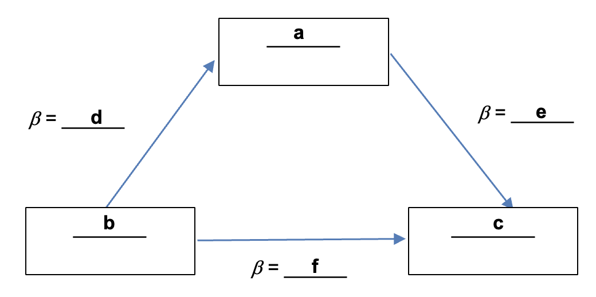

a = `r fitb('sleep quality')`
b = `r fitb('stress')`
c = `r fitb('academic performance')`
d = `r fitb(0.058)`
e = `r fitb(0.147)`
f = `r fitb(0.055)`

*Figure 1*. Mediation model showing the effect of `r fitb('stress')` (independent variable) on `r fitb('academic performance')` (outcome) mediated by `r fitb('sleep quality')` (mediator). 

`r mcq(c('As predicted', answer = 'Contrary to predictions'))`, the mediation analysis showed a `r mcq(c('significant', answer = 'non-significant'))` indirect effect of `r fitb('stress')` on `r fitb('academic performance')` through `r fitb('sleep quality')` (β = `r fitb(0.009)`, 95% CI [`r fitb(-0.03)` , `r fitb(0.05)`], Z = `r fitb(0.432)`, *p* = `r fitb(.665)`). 

7. What might be the mechanisms that account for the observed findings?

:::
::::


## Using medmod in Jamovi to carry out moderation analysis

Continuing with **PredictingRMDGrade.csv**, the made-up dataset about what factors might predict RMD grade. As a reminder, the variables in the dataset are: 

* Interest (Interest in research methods)
* Time_on_insta (Hours per week spent on Instagram)
* Intelligence (IQ score (norm=100))
* Attendance (Number of workshops and lectures attended)
* RMD Grade

For the moderation example, we want to explore the idea that while the effect of time spent on insta (instead of studying) is likely to reduce the RMD grade a student might achieve, this detrimental impact is moderated by intelligence. In other words, the relationship between time on insta and RMD Grade interactions with intelligence. The idea is that people who are more intelligent are less likely to experience a reduction in RMD grade as a result of spending more time on insta than those who are less intelligent. Or in more technical language, there is an interaction between time on insta and intelligence.

In the model we want to test, RMD grade is the DV (Y), Time on insta is the IV (X) and Intelligence is the moderator (M).


1.	Load the **PredictingRMDGrade.csv** data
2.	In the medmod menu, select moderation.

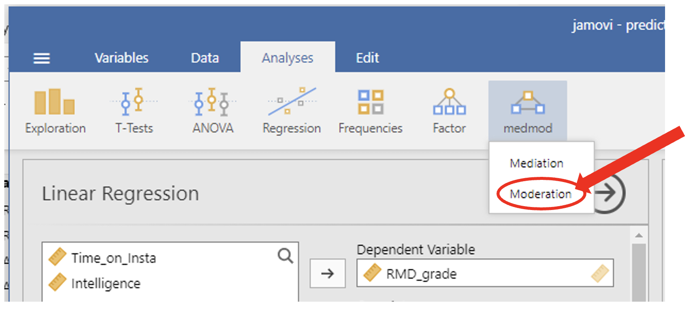

3. Set up the moderation analysis: 
    a. Put the DV (RMD_grade) into the Dependent Variable box 
    b. Put the IV (Time_on_insta) in the Predictor box
    c. Put the Moderator (Intelligence) in the moderator box. 
    d. In the options in the lower part of the moderation panel, select the following options: 
        i. In 'Estimation Method for SE's', select 'Standard'
        ii. In 'Estimates', select 'Test Statistics', and 'Confidence interval' with the interval being 95%
        iii. In 'Simple Slope Analysis', select 'Estimates', and 'Plot'.

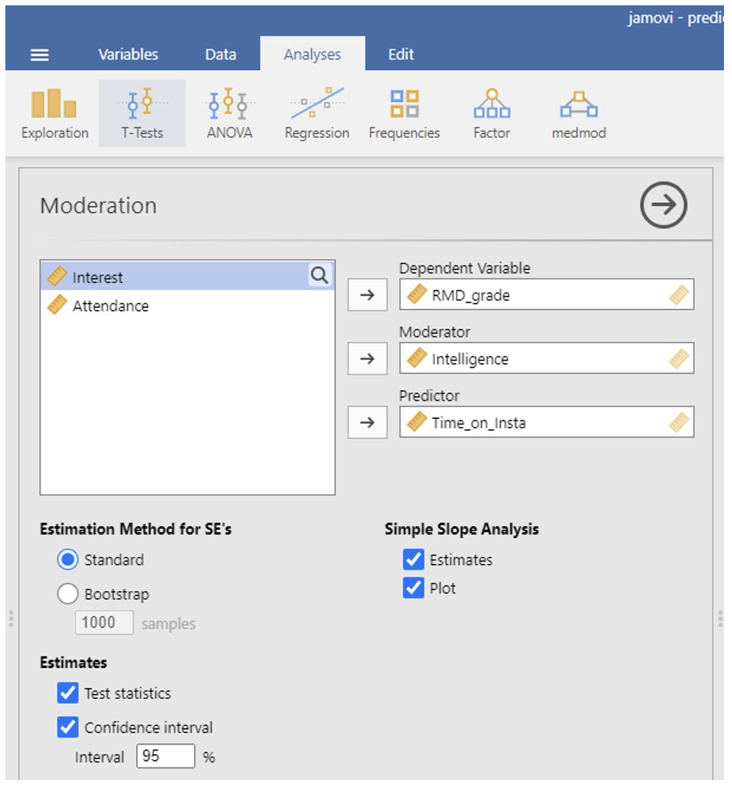

### Output: Moderation (medmod)

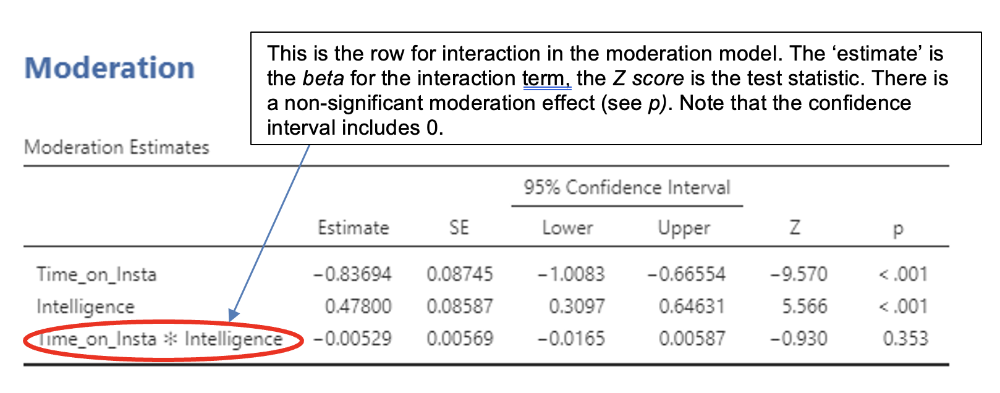

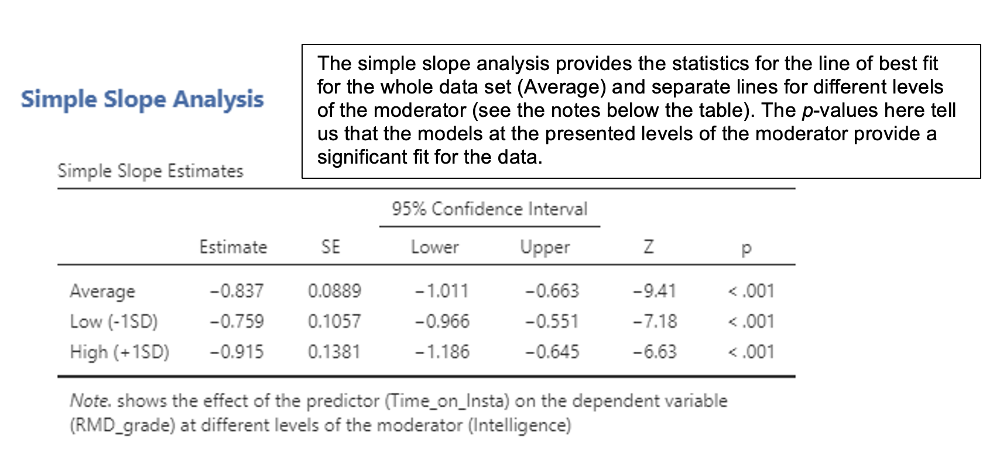

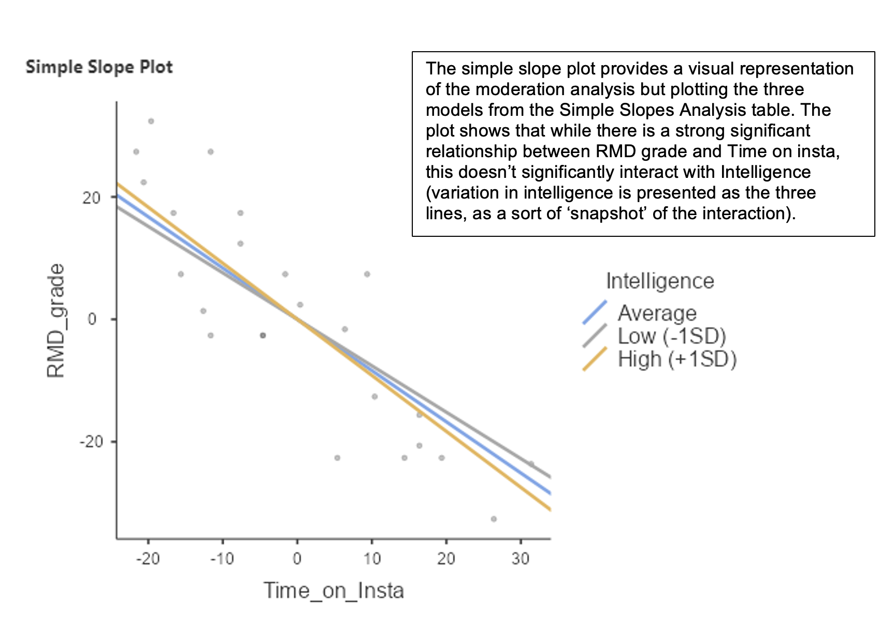

### Reporting a moderation analysis 
When reporting a moderation analysis, you should include the following information:

* An outline of how the analysis was performed under the Data Analysis subheading of the Method
* A specification of what the analysis was used to test (information about the variables involved)
* A figure illustrating the relationship between the variables
* Include the beta (estimate) for the effect, the 95% confidence interval, the Z-score, and the p-value.
* A figure illustrating the interaction between the moderator and the IV
* Acknowledge how the analysis relates to your hypothesis.

*Example report of the analysis about predicting RMD Grades from time on insta and whether this relationship is moderated by intelligence:*

*Data analysis*
A moderation analysis, using jamovi’s medmod module (The jamovi project, 2025), was performed to investigate the interaction between time on insta (IV) and intelligence (moderator), and its effect on RMD grade (DV). 

*Results*
Data from 25 participants was analysed to test the hypothesis that intelligence would interact with time spent on insta, such that the effect of time on insta would be less detrimental to RMD grade, the higher the intelligence of the participant (see Figure 1).

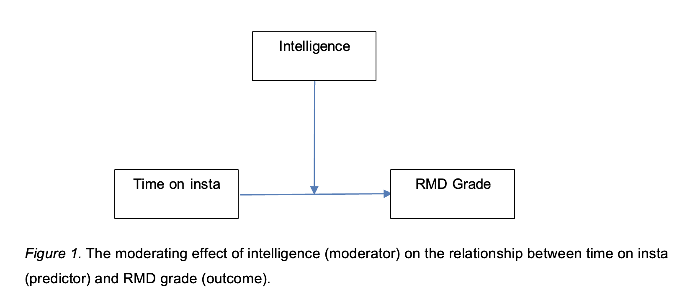

However, contrary to predictions, the intelligence did not have a significant moderating effect on the effect of time on insta on RMD grade (β = -0.01, Z = -0.93, *p* = .353). The estimates of the moderation analysis are presented in Table 1.

Table 1. Moderation estimates for the effect of intelligence (moderator) on the relationship between time on insta (predictor) and RMD grade (outcome).

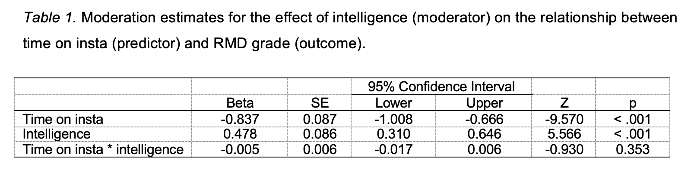

Note: For discussing moderation effects, think about possible mechanism that can explain the interactions or lack of interactions between the variables. For the intelligence and time on insta example, comment on what might explain why there doesn’t appear to be the expected interaction effect (i.e. why might the impact of time spent on insta on RMD grade be the same regardless of the level of intelligence of the participants?).


## Jamovi Tasks - Moderation

*Does class participation moderate the effect of study hours per week upon academic performance?*

Using **Studyhrs_partici_AdadPerf_moderation.csv**, test the hypothesis that class participation moderates the effect of study hours per week upon academic performance.

Carry out a moderation analysis.

:::: callout-tip
## Test your understanding

::: panel-tabset
## Moderation analysis

1. Do study hours per week have an effect upon academic performance? `r mcq(c(answer = 'Yes', 'No'))`

2. Does class participation have an effect upon academic performance? `r mcq(c(answer = 'Yes', 'No'))`

3. Do study hours per week and class participation interact? `r mcq(c('Yes', answer = 'No'))`

4. Do the results support the hypothesis? `r mcq(c('Yes', answer = 'No'))`

5. Fill in the blanks to report the findings of this analysis: 

Data analysis
A moderation analysis, using jamovi’s medmod module (The jamovi project, 2025), was performed to investigate the interaction between `r fitb('study hours per week')` (IV) and `r fitb('class participation')` (moderator), and its effect on `r fitb('academic performance')` (DV). 

Results
Data from 30 participants was analysed to test the hypothesis that `r fitb('class participation')` would interact with `r fitb('study hours per week')`, such that the effect of `r fitb('study hours per week')` would be more beneficial to `r fitb('academic performance')`, the  greater the `r fitb('class participation')` of the participant (see Figure 1).

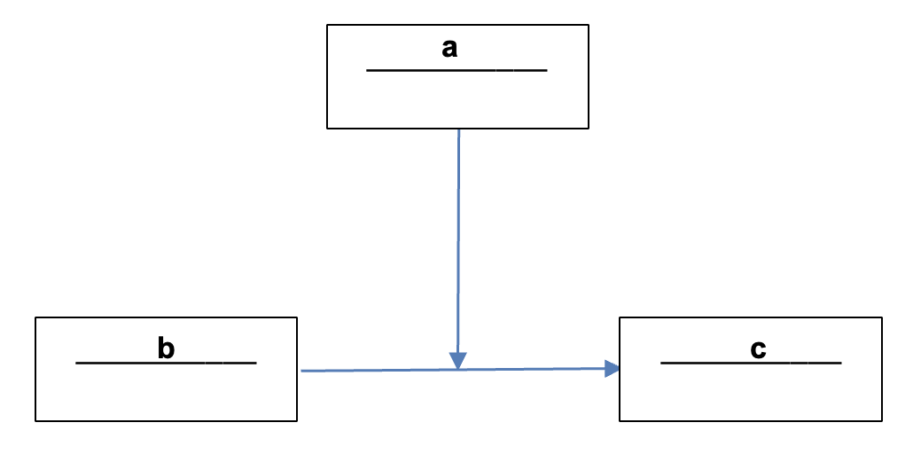

a = `r fitb('class participation')`
b = `r fitb('study hours per week')`
c = `r fitb('academic performance')`

Figure 1. The moderating effect of `r fitb('class participation')` (moderator) on the relationship between `r fitb('study hours per week')` (predictor) and `r fitb('academic performance')` (outcome).

`r mcq(c('As predicted', answer = 'Contrary to predictions'))`, `r fitb('class participation')` `r mcq(c('had', answer = 'did not have'))` a significant moderating effect on the effect of `r fitb('study hours per week')` on `r fitb('academic performance')` (β = `r fitb(0.01)`, Z = `r fitb(1.80)`, *p* `r mcq(c(answer = '=', '<'))` `r fitb(0.072)`. The estimates of the moderation analysis are presented in Table 1.


|  | Beta | SE | Lower | Upper | Z | *p*
|----|---|---|---|---|---|---|
|`r mcq(c('Class participation', answer = 'Study hours per week', 'Study hours per week * Class participation'))`| `r fitb(0.018)` | `r fitb(0.008)`| `r fitb(0.003)`| `r fitb(0.033)`| `r fitb(2.41)`| `r fitb(0.016)`|
|`r mcq(c(answer = 'Class participation', 'Study hours per week', 'Study hours per week * Class participation'))`| `r fitb(0.072)` | `r fitb(0.026)`| `r fitb(0.021)`| `r fitb(0.122)`| `r fitb(2.76)`| `r fitb(0.006)`|
|`r mcq(c('Class participation', 'Study hours per week', answer = 'Study hours per week * Class participation'))`| `r fitb(0.006)` | `r fitb(0.003)`| `r fitb(-0.0005)`| `r fitb(0.013)`| `r fitb(1.80)`| `r fitb(0.072)`|

6. Look at the simple slope plot. Disregrarding the question of whether this moderation effect is or is not significant, describe the nature of the interaction? (*Hint: For which combination of IV and moderator is the relationship between IV and DV the strongest?*)

7. What might be the mechanisms that account for the observed findings? 

:::
::::