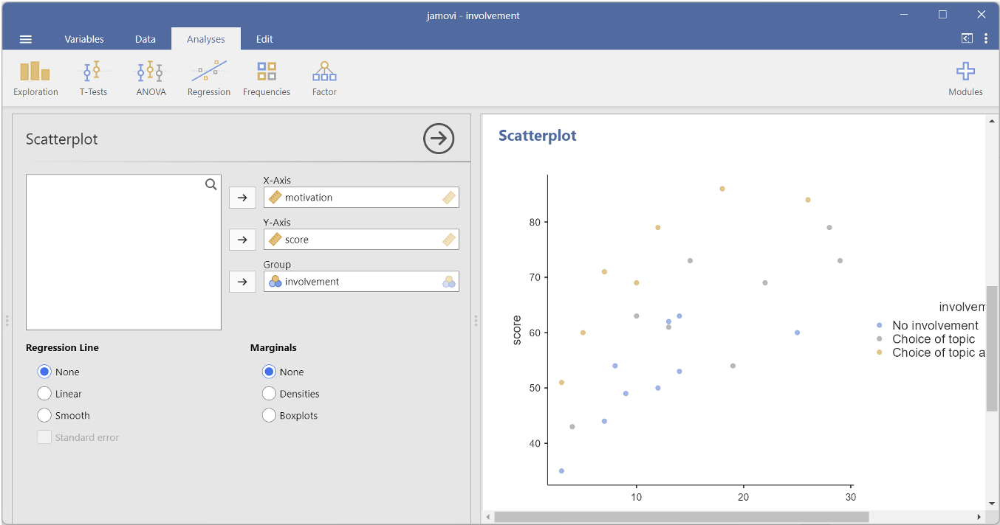
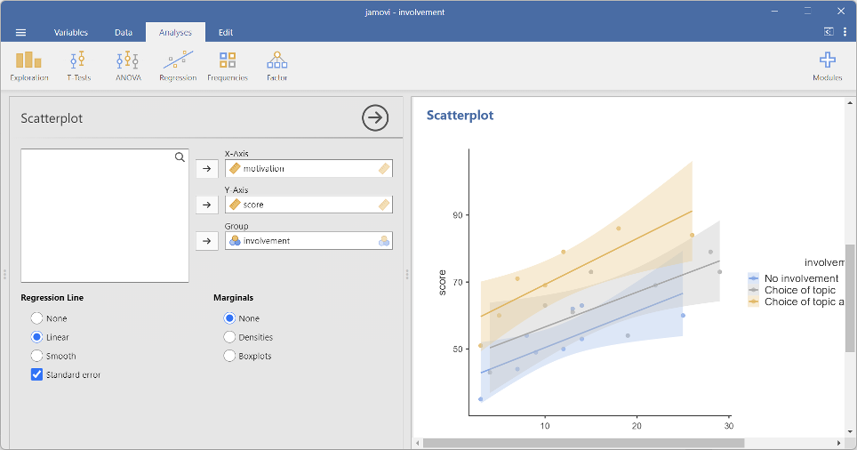
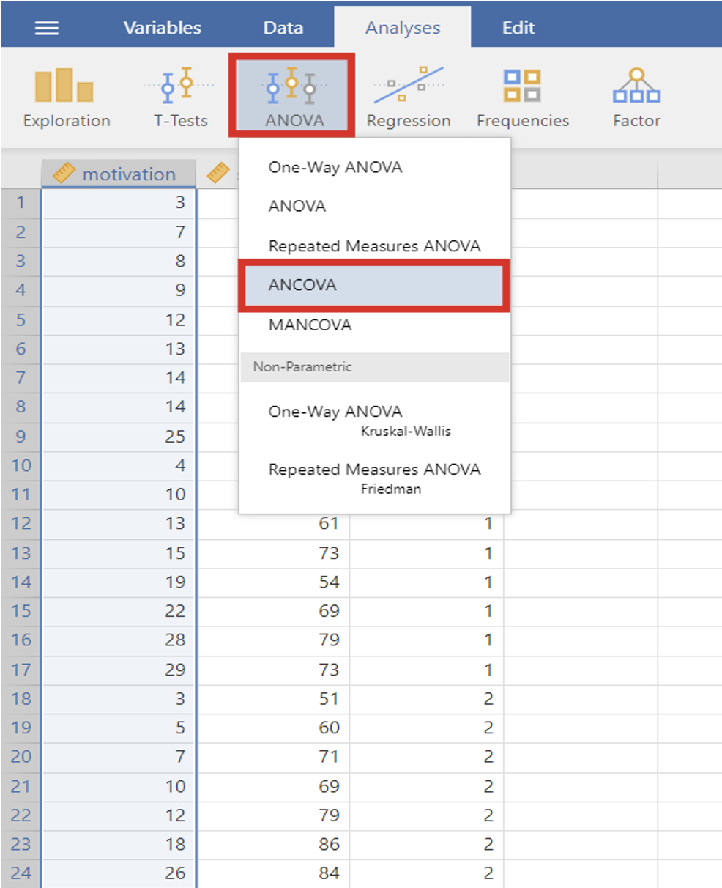
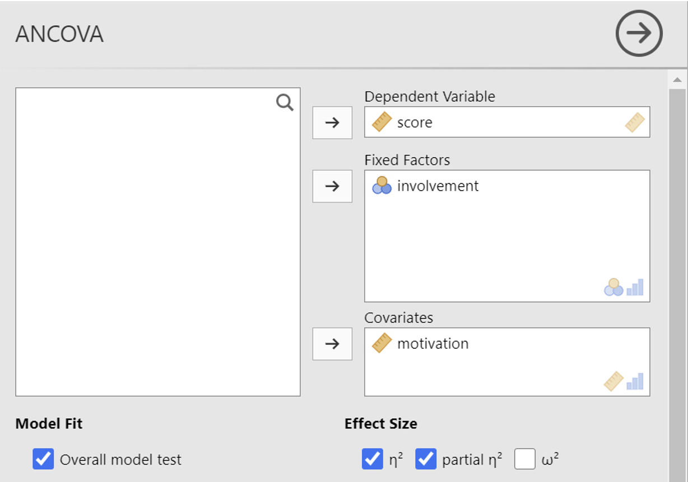
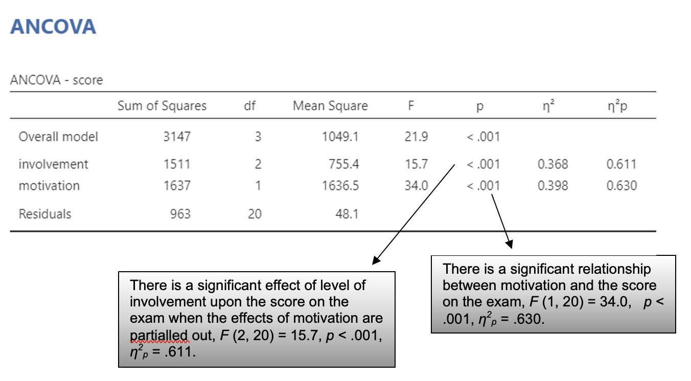
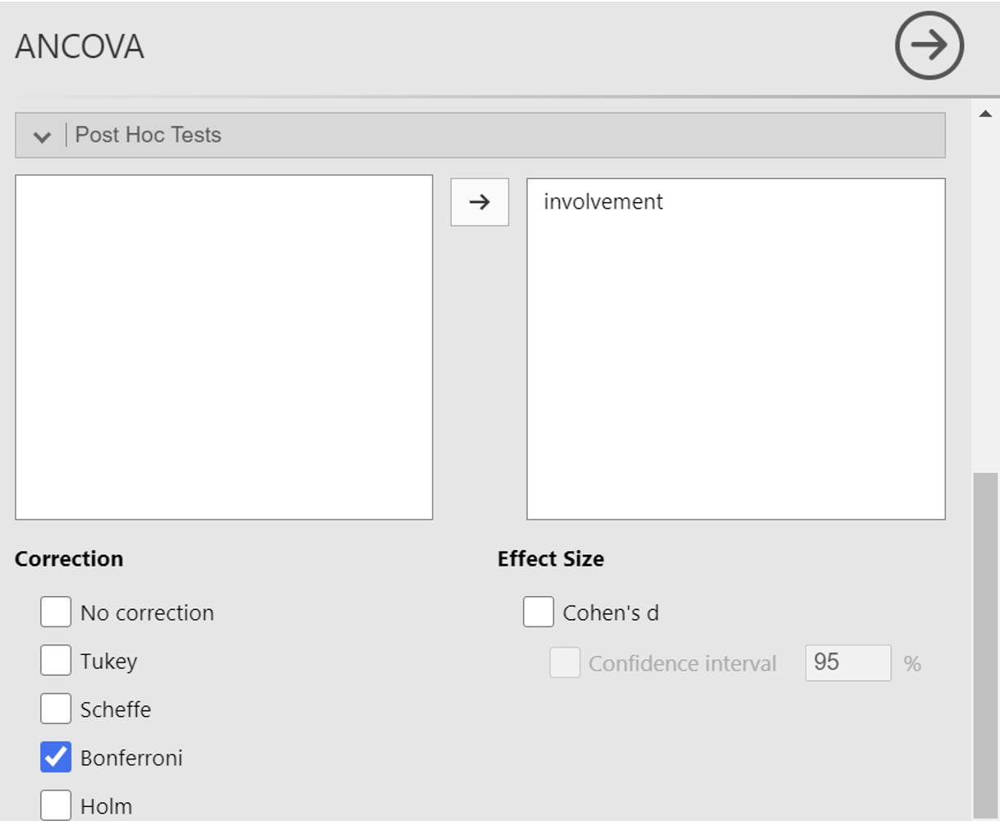
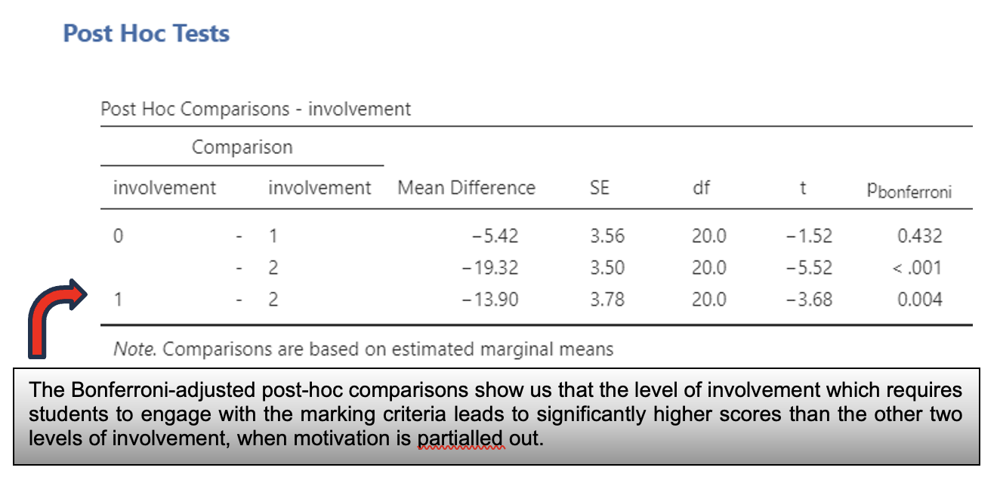
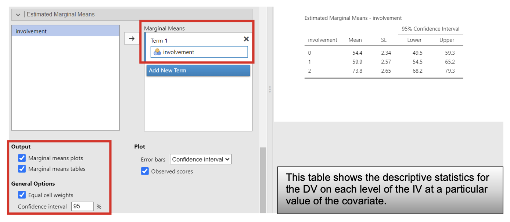

```{r}
#| echo: false
library(webexercises)
```

# Week 11: Introduction to ANCOVA with Jamovi {.unnumbered}

## Learning Objectives

When you have completed this workshop, you should be able to:

1. Choose when to perform an ANCOVA
2. Use Jamovi to perform ANCOVA on a single factor with three or more levels to partial out the effects of a covariate
3. Interpret the Jamovi output of an ANCOVA and write up an ANCOVA


## Analysis of Covariance: Combining ANOVA and linear regression 

This workshop goes over a simple ANCOVA on Jamovi  and shows you how to interpret the output and write up such analyses.

ANCOVA stands for analysis of covariance. It combines the principles of analysis of variance, which we covered in RMC with the principles of regression. In this way, we can examine if different groups score differently on a DV, while partialling out (controlling for) the effect of another variable in a linear relationship with the DV. This variable is called the covariate. 

In Workshop 1, we looked at partial correlations which look at the relationship between two variables while taking into account the possible variance explained by the relationship with another variable. Something similar takes place when an ANCOVA is carried out: we remove the variance explained by the relationship of the DV with the covariate, to ‘isolate’ the effect of the IV on the DV itself.

### Using Jamovi Exploration to create a scatter plot with regression lines for each group 

Open the **involvement** data set. This made-up data set tests the hypothesis that changing the level of involvement in the assessment process affects students’ final scores. Three groups of students were randomly assigned to three groups. The ‘No involvement’ group (0) completed an assessment designed by their lecturer without choice of topic. The ‘Choice of topic’ group (1) completed an assessment designed by their lecturer, but for which they could choose the topic to which to apply the task. The ‘Choice of topic and engagement with marking criteria’ group (2) completed an assessment designed by their lecturer, chose their own topic, and also participated in discussions and exercises about the marking criteria. Final scores on the assessment were compared across the groups. However, since the level of motivation of the students at the start of the task might have an effect upon the final score, motivation was also recorded.

1. Select analysis -> exploration -> scatterplot 

2. To populate the graph with data, select the variables to plot on each of the graph axis. Drag-and-drop each variable on to an axis of the graph as shown in the image below, with the grouping variable in the group box, the DV in the y-axis and the covariate in the x-axis. 

3. The output looks like a scatter plot with multiple lines on it. 





For ANCOVA to be carried out meaningfully, the lines of fit for the groups need to be parallel or nearly parallel. They are in this example. 

### Using Jamovi to carry out a one-way between participants ANCOVA 

Open the file **involvement.csv**. In the JAMOVI main window, click on the "Analyses" tab in the top menu, then select "ANOVA" from the list of analysis options. In the ANOVA options, select "ANCOVA" from the dropdown menu. 

In the ANCOVA dialogue box, you will need to specify the dependent variable (the outcome variable you want to analyze), the independent variable (the grouping variable), and the covariate (the variable you want to control for).

Depending on your specific analysis, you may need to adjust additional options such as select Bonferroni option from ‘correction’ drop down menu and tick on cohen’s D from ‘Effect size’ option.  





### Output: ANCOVA



Since this ANCOVA was significant, we need to carry out post-hoc analyses to identify when the differences lie. 







### Writing up an ANCOVA
Here is an example write-up for this ANCOVA

“After adjusting for level of motivation, the adjusted mean examination scores were highest in the ‘choice of topic and engagement with the marking criteria’ group (M = 73.8 marks, SEM = 2.7 marks), with the scores in the ‘choice of topic’ group slightly higher (M = 59.9 marks, SEM = 2.6 marks) than those in the ‘no involvement’ group (M = 54.4 marks, SEM = 2.3 marks). A one-way between participants ANCOVA, using level of motivation as the covariate, found a significant main effect of level of involvement upon examination scores, F (2, 20) = 15.695, p < .001, η2p = .611. Paired comparisons using a Bonferroni correction showed that only the ‘choice of topic and engagement with the marking criteria’ group led to significantly higher scores in examination scores compared to ‘no involvement’ (mean increase = 19.3 marks, p < .001) and ‘choice of topic’ (mean increase = 13.9 marks, p < .001). There was no significant difference between the examinations scores of the ‘no involvement’ and ‘choice of topic’ groups (mean increase = 5.4 marks, p = .432). These findings partially supported the hypothesis that more involvement in the assessment process would improve examinations scores, in that choice of topic and engagement with the marking criteria increased scores, however, choice of topic on its own did not lead to higher scores.”

## Jamovi Task: ANCOVA
*The effect of type of chocolate on memory*

Using **chocmemory**, test the hypothesis that eating high carb chocolate (2) would improve the score on a recall task more than low carb chocolate (1). But since participants may vary in their overall ability to recall information, baseline recall data was collected in a recall task before the chocolate was consumed.

Carry out an ANCOVA using the baseline memory data as a covariate. (HINT: Don’t forget to inspect your grouped scatterplot with regression lines for each group.)

:::: callout-tip
## Test your understanding

::: panel-tabset
## ANCOVA

1. Were the regression lines for the two groups parallel/near-parallel? `r mcq(c(answer = 'Yes', 'No'))`

2. What was the R^2^ for each type of chocolate? Boots LoCarb = `r fitb(0.009)`, Tesco Milk = `r fitb(0.009)`

3. Are the before and after memory scores significantly associated? `r mcq(c(answer = 'Yes', 'No'))`

4. Is there a significant effect of type of chocolate upon recall? `r mcq(c(answer = 'Yes', 'No'))`

5. Report the adjusted mean recall scores for each type of chocolate? Boots LoCarb = `r fitb(62.8)`, Tesco Milk = `r fitb(67.9)`

6. Report the standard errors of the mean for each type of chocolate? Boots LoCarb = `r fitb(1.13)`, Tesco Milk = `r fitb(1.13)`

7. Write a paragraph reporting the findings of this analysis.

:::
::::
