```{r}
#| echo: false
library(webexercises)
```

# Week 9 : Simultaneous Multiple Regression and Hierarchical Multiple Regression {.unnumbered}

## Learning Objectives

When you have completed this workshop, you should be able to:
1. Carry out regression analyses with more than one predictor variable using Jamovi.
2. Evaluate the results of multiple regression on Jamovi. 
3. Use and interpret the resulting regression equations. 
4. Report a multiple regression using narrative and appropriate tables. 
5. Understand that there are different approaches to carrying out a regression analysis and that these will lead to different outcomes. 

Open **stress1.csv**. The idea with this made-up data set is that it tests the assumption that we can predict the stress (the first column/variable in the data) from several predictors: 

* Work hours 
* Number of children 
* Money spent on leisure 
* Hours spent exercising 
* Salary earned 
* Report of stress (dependant variable) 

1. Load the stress1.csv data 

2. Look at the descriptive data by going to Analyses -> Exploration -> Descriptives 


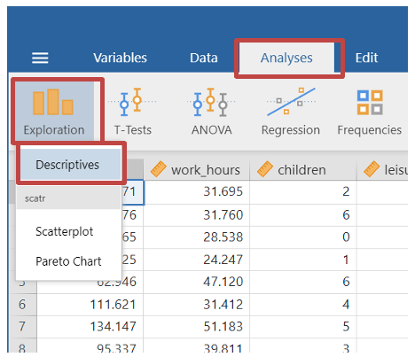


3. Move all the variables to the "Variables" box. 


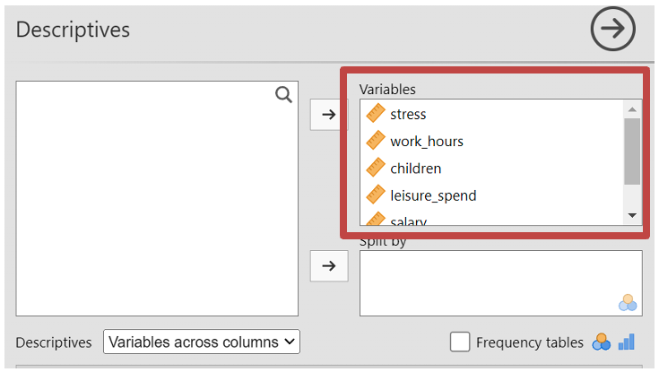


4. In the results you will be able to see the means for each variable for later reporting purpose

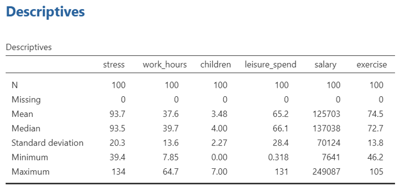


5. Next you may wish to look at how well each variable correlates with one another, to test for assumptions. As shown in previous weeks, select Analyses -> Regression -> Correlation Matrix 

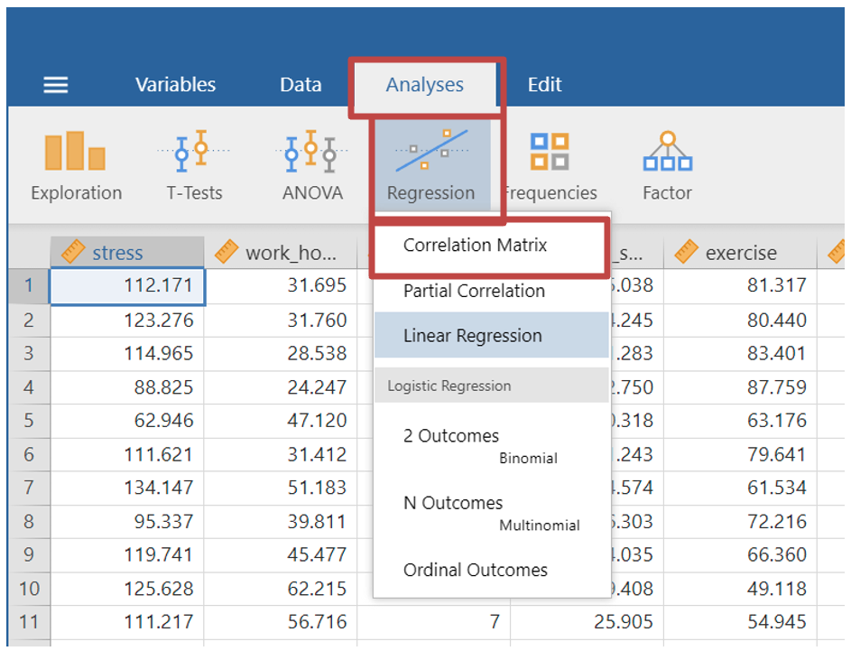

6. Move all your variables from the first box to the second box

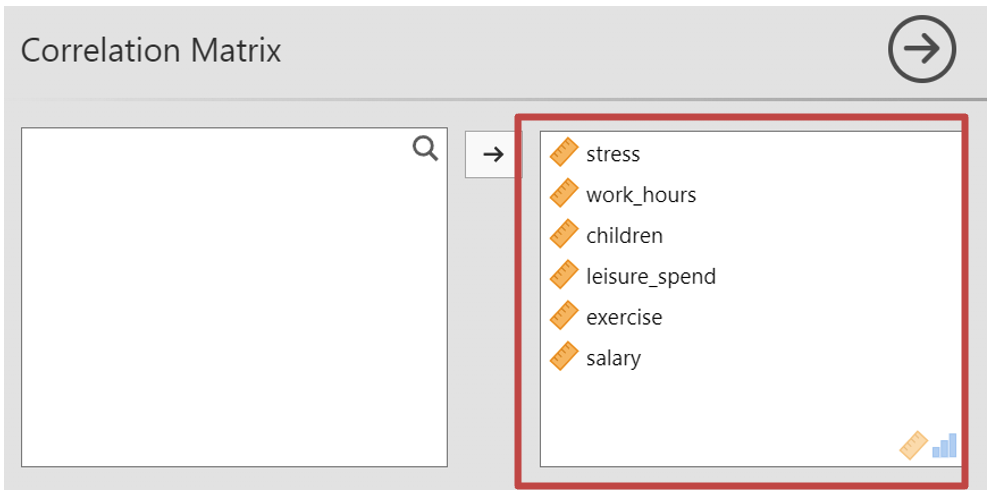

7. In your results section you can then see the correlation matrix. This shows how the different variables you are about to enter into the regression model correlate. You can use this data to test the assumption of multicollinearity among independent variables. 

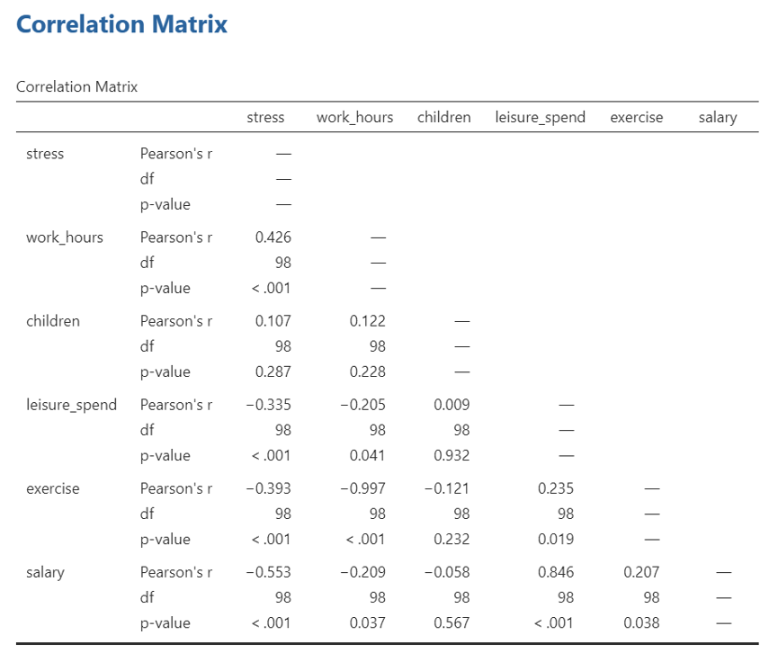

8. Finally you will run the Multiple Linear Regression. Select Analyses -> Regression -> Linear Regression

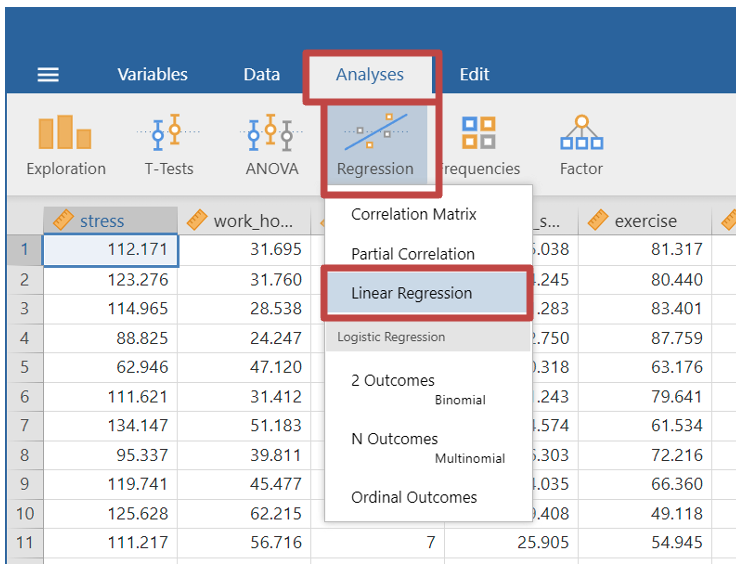

9. Drag your dependent variable to the "Dependent Variable" box. 

10. Drag all your independent variables to the covariates box (note: the covariates box is for continuous independent variables. If you have any categorical variables you would put them in the "Factors" box. However, our data is all continuous). 

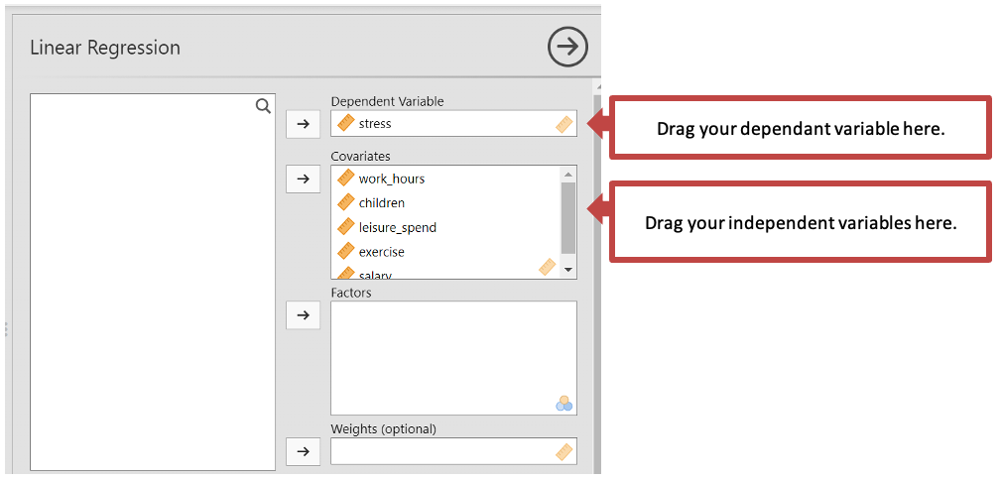

11. Next you will need to set the parameters of you multiple regression. Some aspects of these you will go through another time, but we will go through the important ones for a multiple linear regression. 

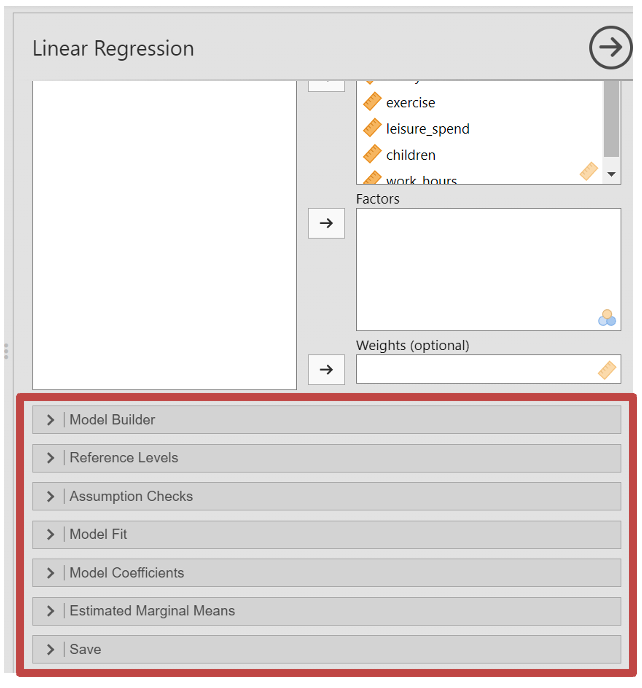

12. Under "Assumption Checks" make sure you tick: 
    a. Autocorrelation test - Assumption of autocorrelation 
    b. QQ plot - Assumption of normality 
    c. Residual plots - Homoscadicity 
    d. Colinearity statistics - Assumption of no multicoliniarity
    e. Assumption of normality - Assumption that the distribution of the residuals should be approximately normally distributed, with a mean of zero 


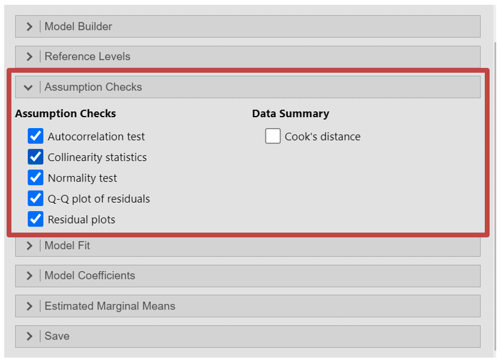

13. Within the "Model Fit" section, you can add some extra outputs to test whether your model fits the data i.e. how well the regression model predicts dependent variable data based on the independent variables. Here you should select the: 

    a. R 
    b. R^2^
    c. Adjusted R^2^
    d. Under "Overall Model Test" select "F test" to see the overall significance of the regression model

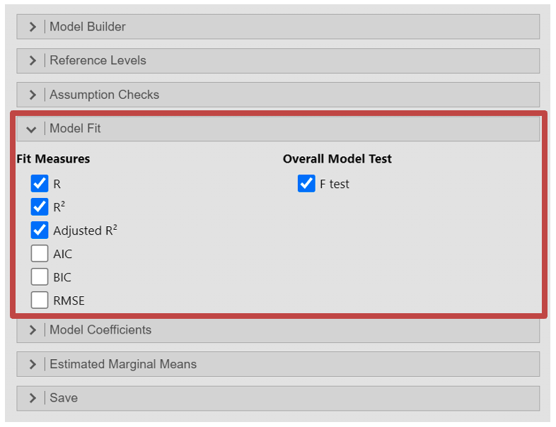

14. In the "Model Coefficients" section you can run various tests on the individual coefficients in the regression model. This will help interpret the relationship and magnitude of the effect of the independent variables to the dependent variable.

    a. Estimate - Confidence interval: this will provide the confidence interval of each coefficient
    b. Standardized Estimate - Standardized Estimate
    c. Standardized Estimate - Confidence interval

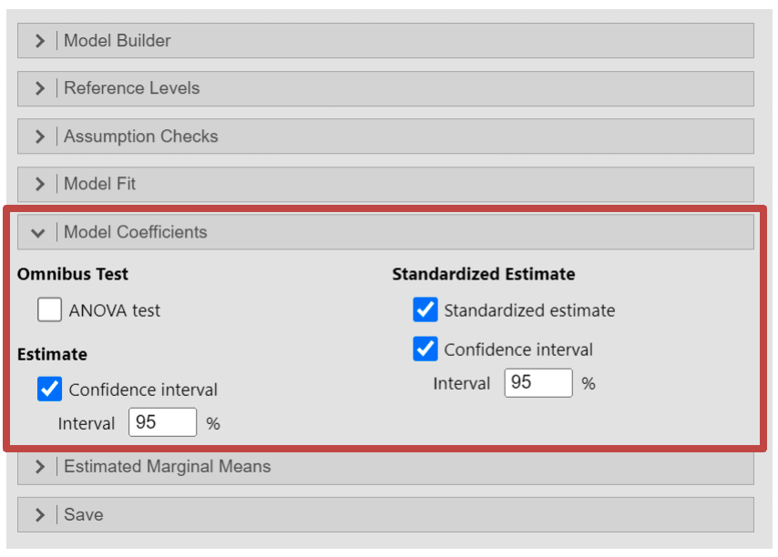

### Output: Multiple Regression

1. The first table "Model Fit Measures" gives you information about the goodness of the models fit for your data. R^2^ is a measure of the variance in the data that the model can explain in the sample tested. The regression was statistically significant: *F*(5, 94) = 30.6, *p* < .001

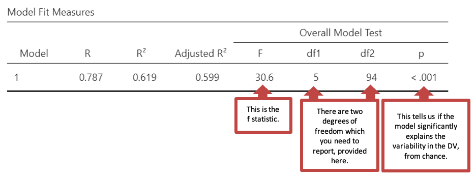

2. Next, in "Model Coefficients" you will see the following table. This table indicates the strength and significance of each predictor. Some values will be in a scientific notation (e.g., -2.43e-5 in salary and Estimate). See note for how to interpret. 

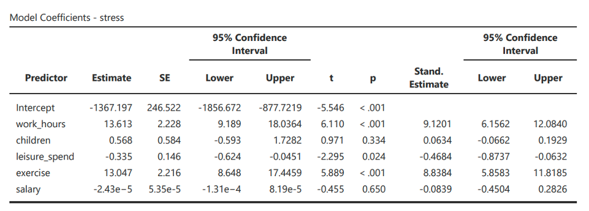

**Note:** from this output, the regression equation estimates that the Regression equation is

$$ 
Stress = -1367.197 + 13.613 \times work\_hours + .568 \times children - .335 \times leisure\_spend + 13.047 \times exercise - .0000243 \times salary
$$


::: {.callout-note}
# Converting a number in scientific notation to standard notation

e.g. 1.4964425329764753e-5

=

1.4964425329764753 x 10-5

=

1.4964425329764753 x 0.00001

=

0.000014964425329764753

e-5 = Move decimal point 5 places to left

:::

3. You will also be allowed to check some assumptions, which you can review in "Assumption Checks". The first is the Durbin-Watson Test for Autocorrelation, which tests for the assumption of autocorrelation. This is when the residuals are not independent of each other, meaning that there is some pattern or correlation between the residuals at different points in the data. If the Durbin-Watson test statistic is close to 2 (typically between 1.5 and 2.5) this indicates there is no serious autocorrelation. Anything above or below suggests a negative or positive correlation between residuals. Here you can see the DW Statistic is 1.97, which means we can continue with the test. 


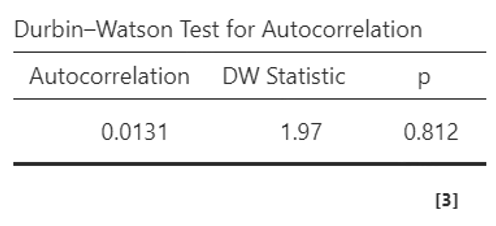


4. Continuing under the "Assumption Checks" section, you can see the "Collinearity Statistics" table, testing the assumption of multicollinearity. This is the extent to which independent variables are correlated with one another. Jamovi uses the VIF statistic (if you have selected this). VIF values above 10 or tolerance values below 0.1 indicate potentially problematic collinearity. 


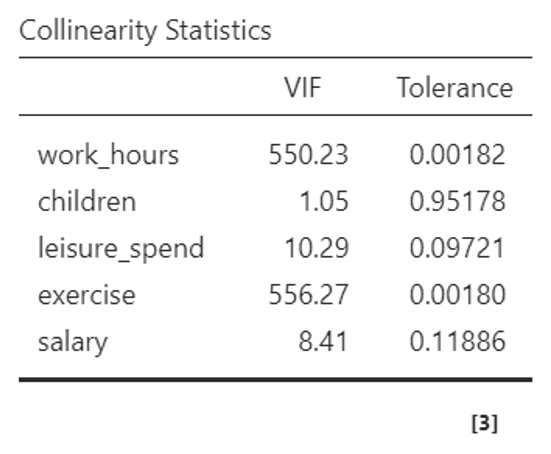


5. Assumption of normality or “Normality Test (Shapiro-Wilk)” table is the assumption that the distribution of the residuals should be approximately normally distributed, with a mean of zero. A p-value lower than 0.05 suggests that the residuals do not follow a normal distribution, and you may wish to select another test. This can also be checked with the QQ plot. If the points on the Q-Q plot closely follow the diagonal line, it suggests that the residuals are approximately normally distributed, supporting the assumption of normality.


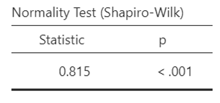


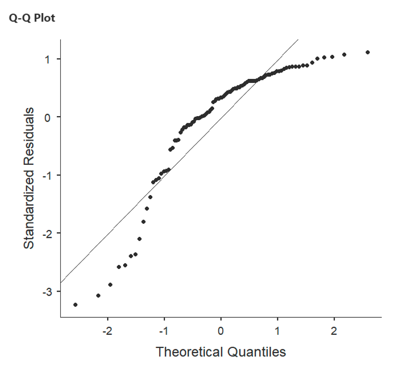


6. The first residual plot where the X axis is labelled “Fitted”, relates to the error/residuals in the regression. It is not a scatterplot of the relationship between the DV and the predictors, those are provided as you scroll down. To test the assumption of homoscedasticity and linearity, you can look to see if there is a random scatter of points as the fitted values increase. This indicates that the relationship between the predictors and the response variable is adequately linear, and that the variance of the residuals are constant (homoscedasticity).


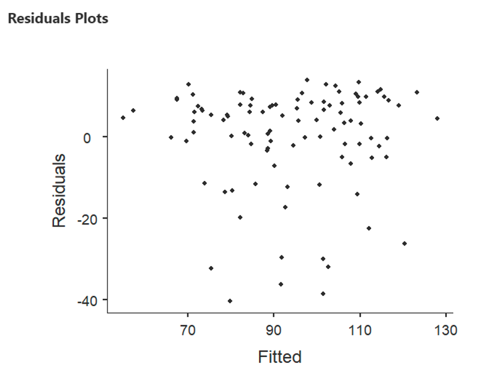

### Writing up a Multiple Regression 

A complete write-up of a multiple regression analysis should include four aspects: 

1. Descriptive statistics for the variables used in the analysis
2. A record of the relationships between the key variables (including a table)
3. A description of the analysis carried out
4. A description or a table of the model(s)

#### Example write up for the multiple regression above: 

"For each variable, the mean, standard deviation and range of scores was recorded (see Table 1). The data showed that participants in the sample tended to be more stressed than not, tended to work full time, and had three children on average. Overall, the participants tended to spend a high number of hours on exercise every month. Weekly leisure spend and salary ranged widely, with some very high salaries making the mean salary for the sample much larger than the national average (Office of National Statistics, 2016)."

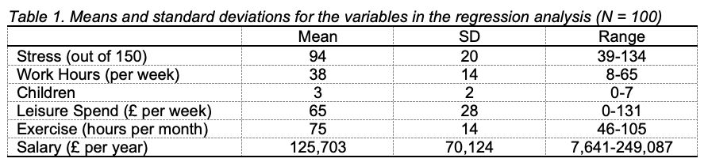

"The correlations between stress and the predictors work hours, children, leisure spend, exercise and salary (see Table 2) showed that stress was positively and moderately correlated with hours worked, negatively and moderately correlated with salary, and negatively and weakly correlated with leisure spend and exercise. Stress was not correlated with the number of children. In fact, none of the five predictors was correlated with the number of children. Work hours were negatively and weakly correlated with leisure spend and salary, and were negatively and very strongly related to exercise. Leisure spend was positively and weakly correlated to exercise and positively and strongly correlated to salary. There was a positive and weak correlation between exercise and salary."

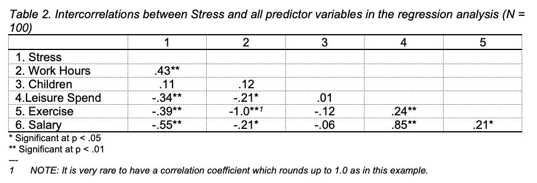

"A regression analysis was conducted to examine which variables predicted stress. The variables were entered simultaneously. Work hours, exercise and leisure spend were significant predictors of stress. All variables together accounted for 62% of the variance in stress in the sample. People who reported higher stress levels also report longer work hours (*β* = 9.12, *p* < .001), tended to exercise less (*β* = 8.84, *p* < .001) and spent less money on leisure activities (*β* = - 0.47, *p* = .024). Neither the number of children (*β* = 0.06, *p* = .334), nor salary (*β* = - 0.08, *p* = .650) were significant predictors of stress."

## Using Jamovi to carry out hierarchical multiple regression 

Open the data file **predictingRMDgrades**, which was used in the lecture. The idea with this made-up data set is that it tests the assumption that we can predict RMD grades based on a couple of predictors:

* Interest in the module

* Time spent on Facebook during the week

* Students’ IQ

* Attendance at taught sessions. 

You can find these variables in the csv file. 

Using this data you will test two models: 

* How much variance in grades can be explained by the predictors that students can control to some extent (interest, attendance, time on FB)

* How much additional variance in grades can be explained by students’ IQ, which student cannot directly control.

    1. Make sure you have loaded the **predictingRMDgrades** data into Jamovi as seen in the first workshop.

    2. Load the descriptives of your data, as you did with the multiple regressions, steps 2-4. After this you will need to look at correlations in your data to test for assumptions of multicollinearity in steps 5-6. 

    3. Go to Analyses -> Regression -> Linear Regression

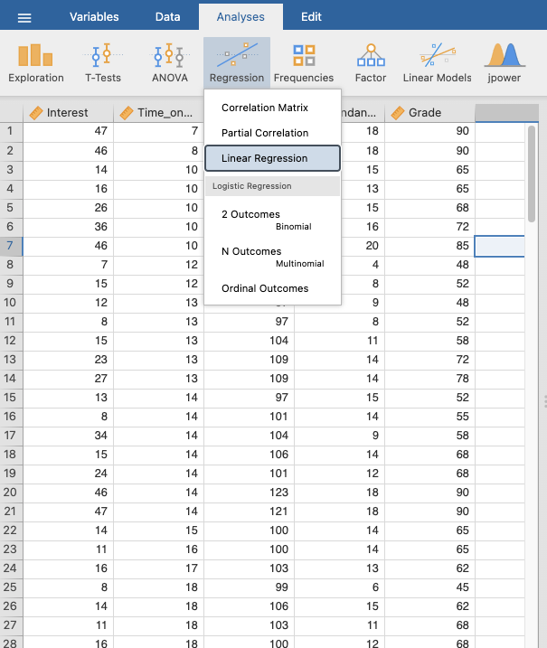

4. Move “RMD Grade” to “Dependant Variable”

5. Move the variables of the first model into “Covariates”, these are all the predictors which students have control over: Time on FB, Attendance, and Interest. 

6. Select the “Model Builder” drop down box as you can see below. Here you can see “Block 1” which represents your first model. Jamovi should automatically place the variables you have just selected into this block. If they have not, then select the predictors and drag them over.

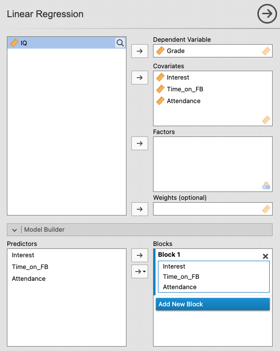


7. You will now create a new block or model, adding “IQ” to see predictors which students have less control over affect results. First click “Add New Block”. You should now see a “Block 2” which is currently empty.

8. Move “IQ” over to the “Covariates” Section

9. “Block 2” should now have "Intelligence", if not, move it from predictors to under “Block 2”.


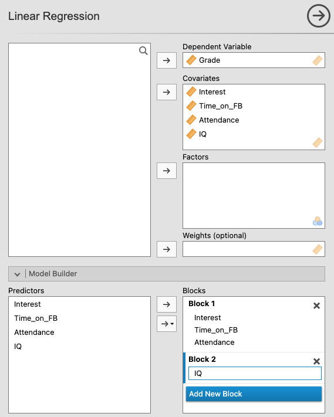


10. You will need to set the parameters of your models. You should follow the steps in the previous “multiple linear regression” section. Whatever you select at that this point, will apply to both models. 

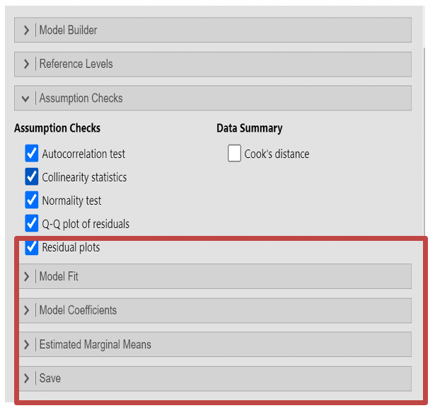


### Output: Hierarchical Multiple Regression

1. As with multiple linear regression the first table, “Model Fit Measures” gives you information about the models fit for your data. (You can remind yourself how to interpret this by reading back within this section). This time you will have a row for each model you created (Model 1 is the first variables you selected; Model 2 is when you included IQ). The regression for Model 1 was statistically significant: *F* (3, 96) = 115, *p* < .001  

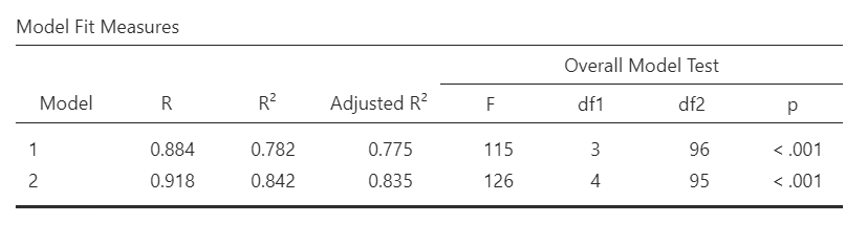


2. The second table “Model Comparisons” gives you information about how different the models are. 

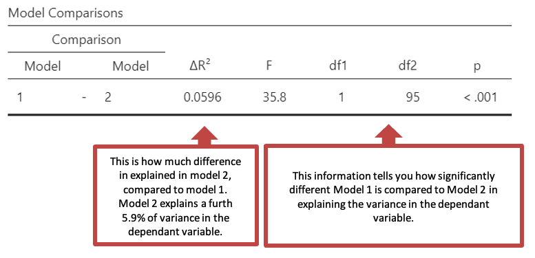

3. You can read how much each predictor explains the dependant variable, for each model in the “Model Specific Results”. Select the drop down next to the title to select which model you would like to see. This will change the tables thereafter based on your models. 

4. First you will see “Model Coefficients” (see below) which will display depending on which model you have selected. The coefficients for individual predictors change between models. Sometimes, a predictor that was significant in one model is no longer significant when another variable is added.

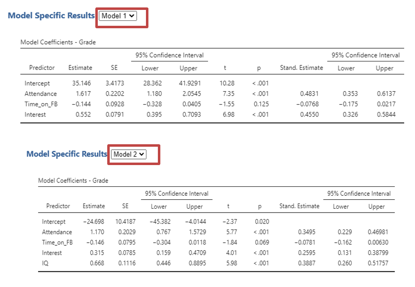

5. You will next be able to check you have met the assumptions of a hierarchical linear regression for each model as long as you select it as above. Follow the Output: Multiple Regression from steps 3-6.

6. Remember that you can find the Beta values under the columns labelled ‘Stand. Estimate’. 

See previous section to help with interpreting the tables. 

### Writing up a hierarchical multiple regression

For each variable, the mean, standard deviation and minimum and maximum scores were recorded (see Table 1). Participants in the sample achieved an average grade of 62.5 and tended to show more interest in research methods than not and attended more sessions than they missed. On average participants spent approximately three hours a day on Facebook, but there was a wide range across the sample. Participants tended to have a higher than average IQ.

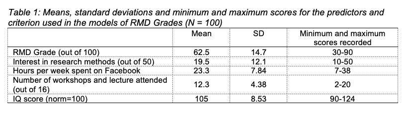


The correlations between RMD grade and the predictors time spent on Facebook (FB), attendance at workshops and lectures, interest in research methods, and IQ score showed that RMD grade was positively and strongly correlated with all predictors except for time spent on FB, which was negatively and strongly correlated with RMD grade. The four predictors were all moderately to strongly correlated with each other (see Table 2).


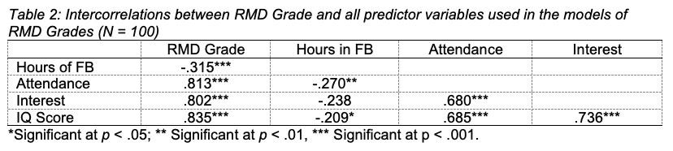


A hierarchical multiple regression analysis was conducted to compare two models for predicting RMD grade. The variables were entered in two steps in order to explore the contribution of the variables more directly under the control of students (i.e., time spent on FB, attendance at workshops and lectures, and interest shown in research methods) separately from the essentially fixed contribution of IQ score. Time spent on FB, attendance and interest were entered on Step 1, and IQ score was added on Step 2. 

As Table 3 shows, only attendance and interest were significant predictors in the first step. In Step 2, attendance, interest and IQ were significant predictors of RMD grade. All variables together accounted for 84% of the variance in RMD grade. Students who reported higher RMD grades also scored more highly on IQ and tended to spend less time on FB. 

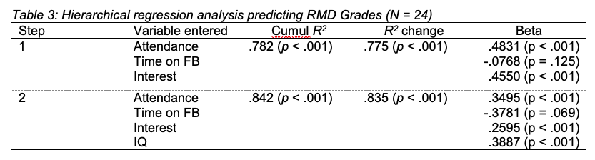

## Different methods to choose which predictor variables should be used in constructing a regression equation
### Measuring how well each model describes or predicts variance 

Ideally a good model for a data set includes only significant predictors. We could carry out the search for a good model ‘manually’. I.e. seeing differences in results when we remove or add a predictor, as Jamovi is dynamic you can see the differences, or so that you can compare each variable, you can add each variable to a different model. You can then see how well the different models predict variance in the dependant variables. To do this select “AIC” and/or “BIC”.

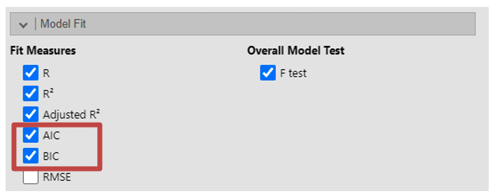


Akaike Information Criterion (AIC) is a measure of the relative quality of statistical models for a given set of data. Lower values of AIC indicate better-fitting models. When comparing models, the model with the lowest AIC is preferred. However, AIC alone does not provide an absolute measure of model fit; it is best used for comparing relative model fit among competing models. Bayesian Information Criterion (BIC) is similar to AIC, in that lower values of BIC indicate better-fitting models. 

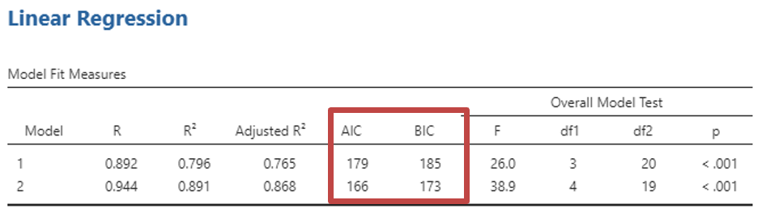

For example, when you come to create your block you can include one variable in the first Block under model builder. In the second block include two variables, in the third block include three variables, and so on. 

**A note of caution: Problems with regression**

Using this approach relies on statistical properties of the data (rather than on psychology) to decide which equations are best and which variables should be included, it is possible that the equations they come up with may be influenced by chance variations in the data set. Redoing the tests on a similar but different set of observations may well produce different results. For this reason, it is unwise to make strong claims about a regression equation you have derived using these methods. This is perhaps why we do not often see such methods reported. Instead many research reports in psychology use **hierarchical regression**, which is a little like a ‘manual’ search for a good model based on psychological theory.


## Jamovi Tasks

The data file **iq** contains made-up IQ scores of 50 students together with their scores out of 10 on 9 imaginary essays. Suppose that a certain School wanted to reduce the number of essays set in the year whilst keeping those that best predict IQ. The lecturers and teaching fellows in the School cannot – however – agree on which essays to drop or even how many to drop. A colleague in Psychology has suggested using regression to solve the problem. The School has asked to see two solutions one with only those essays that have a significant impact on the prediction of IQ and another longer list including additional essays without being overly wasteful (of student or staff effort).

a. Short list: Using Different Models
Run a multiple regression on all the essays with IQ as the dependent variable selecting **an essay for each model** (you should have 9 models in total)

:::: callout-tip
## Test your understanding

::: panel-tabset
## IQ Scores and essays

1. What percentage of the variance in IQ for new students can be predicted by the final equation chosen by the computer? `r fitb(52.8)`%

2. Which essays are included? 

:::
::::
